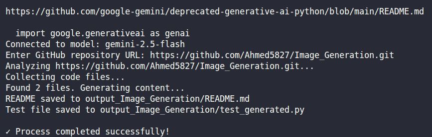
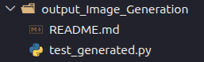

# GitHub Repository Analyzer with Gemini AI 🤖

A modular Python tool that automatically analyzes GitHub repositories using Google's Gemini AI. It reads the codebase and generates a comprehensive `README.md` and a suite of unit tests tailored to the project's language.
---



---
## 🚀 Features

*   **Repository Parsing**: Automatically fetches and parses file structures from GitHub URLs.
*   **Smart Analysis**: Uses Google Gemini Pro/Flash models to understand code logic.
*   **Documentation Generator**: Creates professional `README.md` files describing the project.
*   **Test Generation**: detailed unit tests based on the source code.
*   **Modular Architecture**: Clean separation of services (GitHub, AI, File Management).

## 🛠️ Project Structure

```text
repo_analyzer/
├── main.py               # Entry point
├── config.py             # Environment configuration
├── services/
│   ├── github_service.py # GitHub API interactions
│   └── ai_service.py     # Gemini AI generation logic
├── utils/
│   └── file_manager.py   # File saving utilities
└── .env                  # API Keys (Not committed)